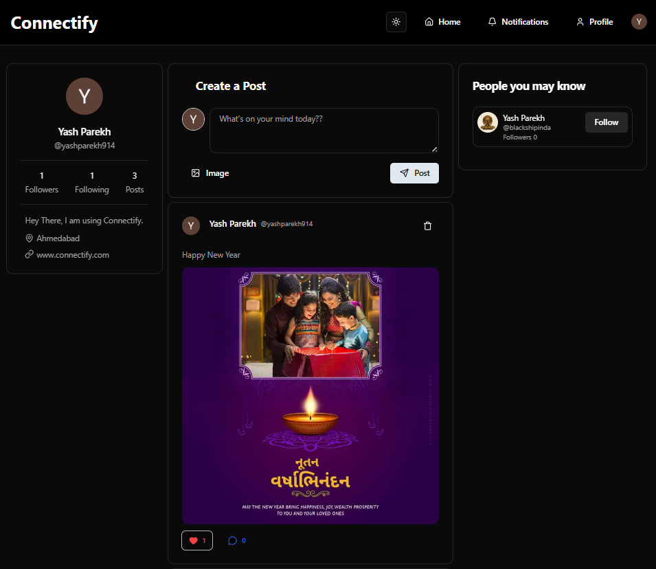
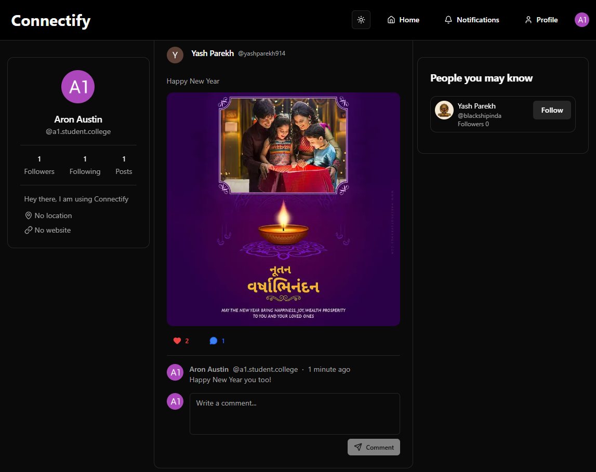
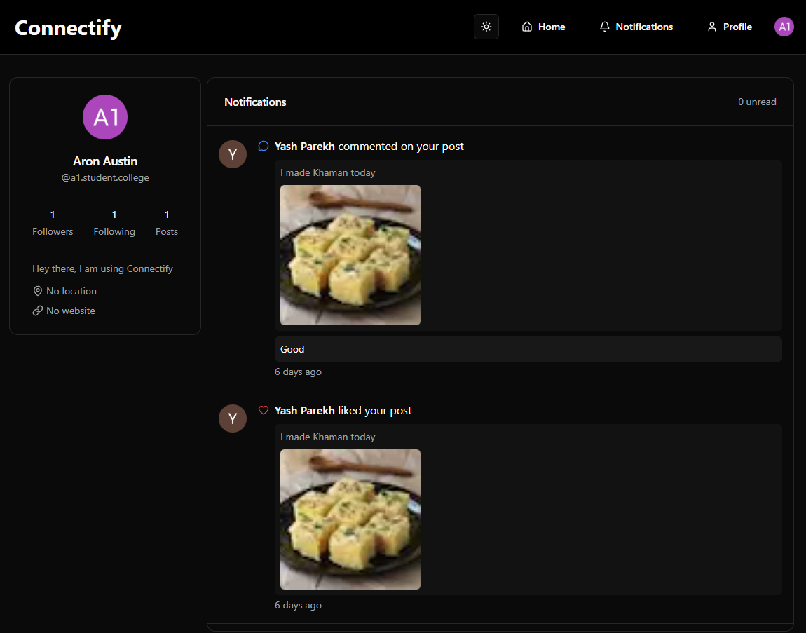
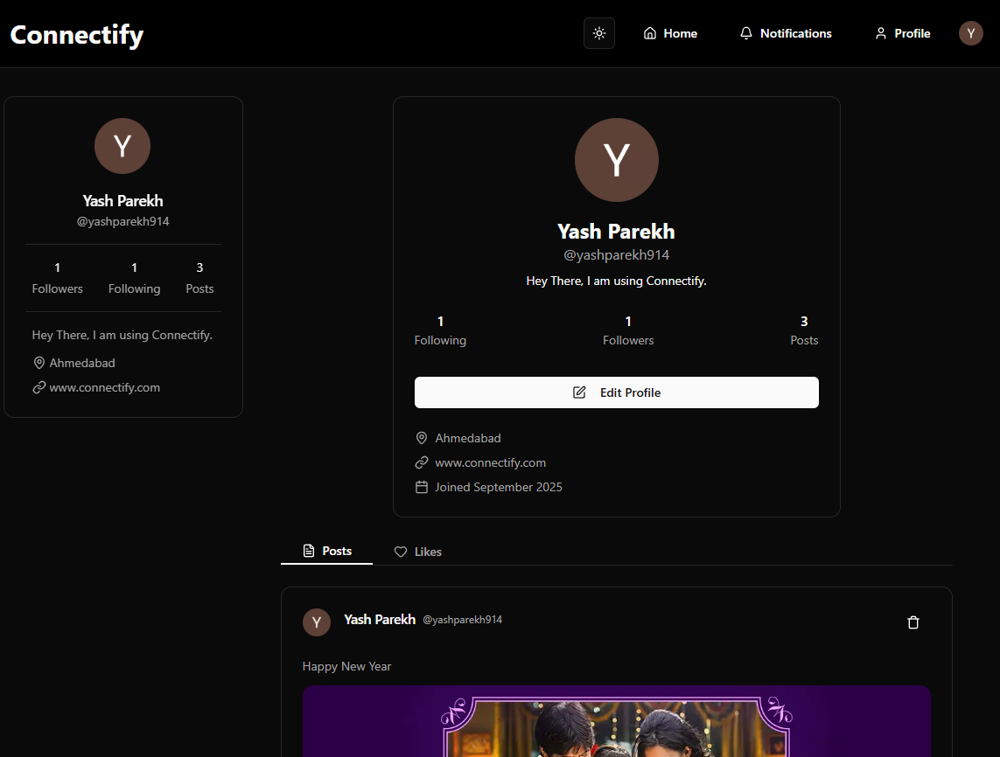

# 🌐 Connectify — A Modern Social Media Web Application

Connectify is a full-stack social media application where users can connect with others, share posts, like and comment, follow other people, and explore profiles — just like popular platforms such as Twitter and LinkedIn.

---

## 🚀 Features

### 👥 User Management
- Signup, Login, and Logout functionality
- Profile creation and editing
- View other users’ profiles
- Follow / Unfollow users
- Create, Like and Comment post with images

### 📝 Posts
- Create, edit, and delete posts
- View feed of posts from other users
- Like and unlike posts
- Comment on posts and view comments

### ❤️ Social Interaction
- Real-time like and comment updates
- Follow system with followers/following count
- Personalized user feed

### 📱 UI/UX
- Responsive and modern design using **Tailwind CSS**
- Only the **main feed** is scrollable while sidebars remain fixed (like Twitter/LinkedIn)
- Smooth transitions and consistent theme
---

## 🏗️ Tech Stack

| Category | Technologies Used |
|-----------|-------------------|
| **Frontend** | React / Next.js, Tailwind CSS |
| **Backend** | Node.js, Express / Django (depending on setup) |
| **Authentication** | Clerk |
| **Database Service Provider** | Neon |
| **Database** | PostgreSQL |
| **Images storing and uploding provider** | Uploadthing |
| **ORM - Object Relational Mapping** | Prisma |
| **Version Control** | Git + GitHub |

---

---

## 📸 Screenshots  

### Home Page  


### Home Page - Comments Section


### Notifications Page


### Profile Page


---

## ⚙️ Installation & Setup

### 1️⃣ Clone the repository
```bash
git clone https://github.com/Yash-1485/connectify.git
cd connectify
```
### 2️⃣ Install the dependencies
```bash
npm install
```
### 3️⃣ Generate the Prisma Client
```bash
npx prisma generate
```
### 4️⃣ Start the app
```bash
npm run dev
```

---
## Future Enhancements

- Direct messaging (DM) & group chats
- Real-time push notifications
- Search and explore tab
---